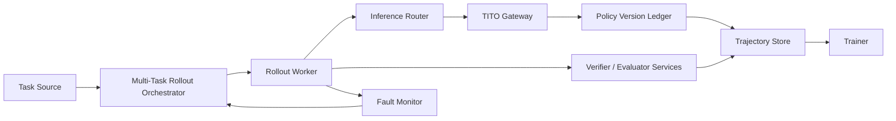

# Architecture

## Design Goal

The project mirrors the architecture pattern emphasized by the source skill: decouple rollout generation from training, keep trajectory records token-exact, and make verifiers first-class services rather than afterthoughts.

## Default Component Stack

- multi-task rollout orchestrator
- rollout workers
- inference router
- TITO gateway
- trainer
- verifier and evaluator services
- policy version ledger
- fault monitor

## Dataflow

## Why TITO Matters

The skill treats token-in-token-out as structural, not cosmetic. In asynchronous RL, re-tokenizing final text later can change:

- whitespace boundaries
- special-token placement
- truncation boundaries
- action-token correspondence

This repository therefore treats exact trajectory capture as a core design primitive.

## Why Version Tracking Matters

Async rollouts can span multiple updates. That makes stale data unavoidable unless the system:

- records which policy versions produced each trajectory
- enforces age thresholds
- clips or masks token contributions outside the trust region

Without that discipline, throughput improves while learning quality quietly degrades.

## Why Evaluators Are Part Of The Architecture

The source material assumes reward hacking will happen. That means evaluators cannot be bolted on later. They need to execute tests, inspect evidence, or render outputs directly so that the reward backbone remains grounded in real state transitions.

## Paper-Grounded vs Extension

Paper-grounded:

- async rollout-training decoupling
- TITO trajectory handling
- staleness filtering
- cache-affinity-aware routing
- environment-centric training design

Reasonable extension in this repo:

- packaging these ideas as reusable Python blueprint models
- exposing a CLI to render design-ready planning artifacts
- making evidence buckets a first-class API concept

